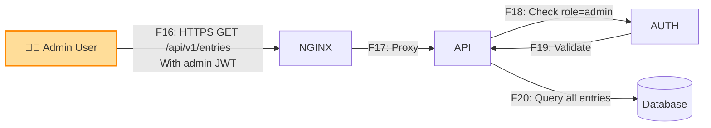

# Data Flow Diagram (DFD) - Reading List API

> **Проект:** Reading List API
> **Версия:** 1.0
> **Дата:** Октябрь 2025
> **Автор:** NKChyong

## Введение

Данный документ содержит диаграмму потоков данных (Data Flow Diagram) для системы Reading List API. Диаграмма показывает границы доверия, основных участников, компоненты системы и потоки данных между ними.

---

## 1. Основная DFD

```mermaid
flowchart TB
    subgraph Internet["🌐 Internet (Untrusted)"]
        USER[👤 User Browser]
        ATTACKER[🚫 Potential Attacker]
    end

    subgraph DMZ["Trust Boundary: DMZ / Edge"]
        direction TB
        NGINX[🔒 Nginx/Reverse Proxy<br/>TLS Termination]
        FRONTEND[⚛️ React Frontend<br/>Static Files]
    end

    subgraph AppLayer["Trust Boundary: Application Core"]
        direction TB
        API[🐍 FastAPI Backend<br/>Auth & Business Logic]

        subgraph AuthModule["Authentication Module"]
            AUTH[🔐 Auth Service<br/>JWT/Bcrypt]
        end

        subgraph BusinessLogic["Business Logic"]
            ENTRY[📚 Entry Service<br/>CRUD Operations]
            USER_SVC[👥 User Service]
        end
    end

    subgraph DataLayer["Trust Boundary: Data Persistence"]
        direction TB
        DB[(🗄️ PostgreSQL<br/>Users & Entries)]
        SECRETS[🔑 Secrets Storage<br/>JWT Keys, DB Creds]
    end

    subgraph External["External Services (Optional)"]
        METADATA[📖 Metadata API<br/>Book Info]
    end

    %% User flows
    USER -->|F1: HTTPS GET /| NGINX
    USER -->|F2: HTTPS POST /api/v1/auth/register| NGINX
    USER -->|F3: HTTPS POST /api/v1/auth/login| NGINX
    USER -->|F4: HTTPS GET /api/v1/entries<br/>Authorization: Bearer JWT| NGINX
    USER -->|F5: HTTPS POST /api/v1/entries<br/>Authorization: Bearer JWT| NGINX

    %% Attacker attempts
    ATTACKER -.->|A1: Brute Force<br/>SQL Injection<br/>XSS Attempts| NGINX

    %% DMZ to App
    NGINX -->|F6: HTTP (internal)<br/>Request + Headers| FRONTEND
    NGINX -->|F7: HTTP (internal)<br/>Proxy to Backend| API

    FRONTEND -->|F8: HTTP GET/POST<br/>API Calls| NGINX

    %% App internal flows
    API -->|F9: Validate JWT| AUTH
    API -->|F10: Create User| USER_SVC
    API -->|F11: CRUD Entries| ENTRY

    AUTH -->|F12: Read JWT Secret| SECRETS
    USER_SVC -->|F13: Hash Password<br/>Store User| DB
    ENTRY -->|F14: Query/Insert<br/>Entries by owner_id| DB

    %% External API (optional)
    ENTRY -.->|F15: HTTPS GET<br/>Fetch Metadata| METADATA

    %% Styles
    style Internet fill:#ffcccc,stroke:#ff0000,stroke-width:3px
    style DMZ fill:#fff4cc,stroke:#ffaa00,stroke-width:2px
    style AppLayer fill:#ccf2ff,stroke:#0066cc,stroke-width:2px
    style DataLayer fill:#d4edda,stroke:#28a745,stroke-width:2px
    style External fill:#e7e7e7,stroke:#666666,stroke-width:1px,stroke-dasharray: 5 5

    style ATTACKER fill:#ff6666,stroke:#cc0000,stroke-width:2px
    style SECRETS fill:#ffffcc,stroke:#ffaa00,stroke-width:2px
    style DB fill:#99ff99,stroke:#00cc00,stroke-width:2px
```

---

## 2. Легенда

### Границы доверия (Trust Boundaries)

| Зона | Описание | Уровень доверия |
|------|----------|-----------------|
| **Internet (Untrusted)** | Публичный интернет, откуда приходят запросы пользователей и атакующих | ❌ Untrusted |
| **DMZ / Edge** | Пограничная зона: Nginx (TLS termination), статические файлы фронтенда | ⚠️ Semi-trusted |
| **Application Core** | Основная бизнес-логика: FastAPI backend, аутентификация, валидация | ✅ Trusted |
| **Data Persistence** | Хранилище данных: PostgreSQL, секреты | ✅ Highly Trusted |
| **External Services** | Внешние API (опционально): метаданные книг | ⚠️ Semi-trusted |

### Участники (Actors)

| Участник | Роль | Доверие |
|----------|------|---------|
| 👤 **User Browser** | Легитимный пользователь, взаимодействующий через веб-интерфейс | ⚠️ Untrusted |
| 🚫 **Potential Attacker** | Злоумышленник, пытающийся скомпрометировать систему | ❌ Untrusted |

### Компоненты

| Компонент | Технология | Ответственность |
|-----------|------------|-----------------|
| **Nginx/Reverse Proxy** | Nginx | TLS termination, rate limiting, static file serving |
| **React Frontend** | React + Axios | UI, клиентская логика, API calls |
| **FastAPI Backend** | Python + FastAPI | REST API, auth, business logic, validation |
| **Auth Service** | JWT + Bcrypt | Аутентификация, хеширование паролей |
| **Entry Service** | SQLAlchemy ORM | CRUD операции с записями |
| **User Service** | SQLAlchemy ORM | Управление пользователями |
| **PostgreSQL** | PostgreSQL 16 | Персистентное хранилище |
| **Secrets Storage** | Environment variables / Vault | JWT keys, DB credentials |
| **Metadata API** | External HTTP API | Получение метаданных о книгах (опционально) |

---

## 3. Описание потоков данных (Data Flows)

### User → DMZ (External Flows)

| Flow ID | Источник | Назначение | Протокол | Данные | Trust Crossing |
|---------|----------|------------|----------|--------|----------------|
| **F1** | User Browser | Nginx | HTTPS | GET / (статика) | Internet → DMZ |
| **F2** | User Browser | Nginx | HTTPS | POST /api/v1/auth/register<br/>{email, username, password} | Internet → DMZ |
| **F3** | User Browser | Nginx | HTTPS | POST /api/v1/auth/login<br/>{email, password} | Internet → DMZ |
| **F4** | User Browser | Nginx | HTTPS | GET /api/v1/entries?status=<br/>Authorization: Bearer JWT | Internet → DMZ |
| **F5** | User Browser | Nginx | HTTPS | POST /api/v1/entries<br/>{title, kind, link, status}<br/>Authorization: Bearer JWT | Internet → DMZ |

### Attacker Attempts (Threats)

| Flow ID | Источник | Назначение | Тип атаки | Описание |
|---------|----------|------------|-----------|----------|
| **A1** | Attacker | Nginx/API | Multiple | Brute force, SQL injection, XSS, CSRF, etc. |

### DMZ → Application Core

| Flow ID | Источник | Назначение | Протокол | Данные | Trust Crossing |
|---------|----------|------------|----------|--------|----------------|
| **F6** | Nginx | Frontend | HTTP | Static files (HTML/JS/CSS) | DMZ → User |
| **F7** | Nginx | FastAPI | HTTP (internal) | Proxied API requests + headers | DMZ → Core |
| **F8** | Frontend | Nginx | HTTP | API calls from browser | User → DMZ |

### Application Core (Internal Flows)

| Flow ID | Источник | Назначение | Протокол | Данные | Trust Crossing |
|---------|----------|------------|----------|--------|----------------|
| **F9** | FastAPI | Auth Service | In-process | JWT token for validation | Core internal |
| **F10** | FastAPI | User Service | In-process | User registration data | Core internal |
| **F11** | FastAPI | Entry Service | In-process | Entry CRUD operations | Core internal |

### Application Core → Data Layer

| Flow ID | Источник | Назначение | Протокол | Данные | Trust Crossing |
|---------|----------|------------|----------|--------|----------------|
| **F12** | Auth Service | Secrets Storage | ENV/File | Read JWT signing key | Core → Secrets |
| **F13** | User Service | PostgreSQL | PostgreSQL wire | INSERT user (hashed password) | Core → Data |
| **F14** | Entry Service | PostgreSQL | PostgreSQL wire | SELECT/INSERT/UPDATE/DELETE entries<br/>WHERE owner_id = ? | Core → Data |

### External Integrations (Optional)

| Flow ID | Источник | Назначение | Протокол | Данные | Trust Crossing |
|---------|----------|------------|----------|--------|----------------|
| **F15** | Entry Service | Metadata API | HTTPS | GET /metadata?title=<br/>Fetch book info | Core → External |

---

## 4. Альтернативный сценарий: Admin Operations

Для административных операций (доступ к данным других пользователей):



| Flow ID | Источник | Назначение | Протокол | Данные | Особенность |
|---------|----------|------------|----------|--------|-------------|
| **F16** | Admin User | Nginx | HTTPS | GET /api/v1/entries (any owner) | Требуется роль admin |
| **F17** | Nginx | FastAPI | HTTP | Proxied admin request | - |
| **F18** | FastAPI | Auth Service | In-process | JWT validation + role check | RBAC enforcement |
| **F19** | Auth Service | FastAPI | In-process | role=admin confirmed | Authorization decision |
| **F20** | Entry Service | PostgreSQL | PostgreSQL wire | SELECT entries (no owner filter) | Privileged query |

---

## 5. Ключевые точки пересечения границ доверия

### 🔴 Критические пересечения (High Risk)

1. **F2, F3, F4, F5**: Internet → DMZ
   - **Риски:** Все внешние входные данные не доверяются
   - **Контроли:** TLS, input validation, rate limiting, CORS

2. **F7**: DMZ → Application Core
   - **Риски:** Nginx может быть скомпрометирован
   - **Контроли:** Nginx hardening, минимальные права, security headers

3. **F13, F14**: Application Core → Data Layer
   - **Риски:** SQL injection, IDOR, data leakage
   - **Контроли:** ORM (SQLAlchemy), параметризованные запросы, owner_id фильтрация

### 🟡 Средние пересечения (Medium Risk)

4. **F12**: Application Core → Secrets Storage
   - **Риски:** Утечка секретов через логи/dumps
   - **Контроли:** Environment variables, file permissions, no hardcoding

5. **F15**: Application Core → External API
   - **Риски:** SSRF, data tampering, unavailability
   - **Контроли:** Whitelist URLs, SSL verification, timeout, retry logic

---

## 6. Протоколы и шифрование

| Поток | Протокол | Шифрование | Аутентификация | Целостность |
|-------|----------|------------|----------------|-------------|
| F1-F5 | HTTPS | TLS 1.2+ | Server cert | TLS MAC |
| F7, F8 | HTTP | ❌ (internal network) | - | - |
| F13, F14 | PostgreSQL wire | SSL/TLS (рекомендуется) | User/password | PostgreSQL checksum |
| F15 | HTTPS | TLS 1.2+ | API key (optional) | TLS MAC |

### ⚠️ Замечания по безопасности

- **F7, F8** (Nginx ↔ Backend): В текущей конфигурации Docker Compose используется незашифрованный HTTP внутри сети. Для production рекомендуется mTLS или VPN.
- **F13, F14** (Backend ↔ PostgreSQL): Рекомендуется включить SSL для PostgreSQL соединений в production.

---

## 7. Хранилища данных

| Хранилище | Тип | Данные | Чувствительность | Защита |
|-----------|-----|--------|------------------|--------|
| **PostgreSQL - users** | Structured DB | email, username, password_hash, role | 🔴 High | Bcrypt CF=12, RBAC |
| **PostgreSQL - entries** | Structured DB | title, kind, link, status, owner_id | 🟡 Medium | owner_id filtering, RBAC |
| **Secrets Storage** | Environment / Vault | JWT secret, DB password | 🔴 Critical | File permissions, no commits |
| **Nginx logs** | Log files | Access logs, error logs | 🟢 Low | Log rotation, no PII |
| **Application logs** | JSON logs | request_id, user_id, actions | 🟡 Medium | Structured, no passwords |

---

## 8. Внешние зависимости

| Зависимость | Назначение | Доверие | Риски | Контроли |
|-------------|------------|---------|-------|----------|
| **PyPI packages** | Python dependencies | ⚠️ Semi-trusted | Supply chain attacks | Semgrep, CVE scanning, pinned versions |
| **npm packages** | Frontend dependencies | ⚠️ Semi-trusted | Malicious packages | npm audit, lock files |
| **Docker Hub images** | Base images | ⚠️ Semi-trusted | Backdoors, vulnerabilities | Official images, Trivy scanning |
| **Metadata API** | Book info (optional) | ❌ Untrusted | Data tampering, SSRF | Whitelist, validation, timeout |

---

## 9. Предположения и ограничения модели

### Предположения (Assumptions)

1. **Infrastructure security**: Предполагается, что Docker host и network защищены на уровне инфраструктуры.
2. **Physical security**: Предполагается физическая безопасность серверов.
3. **Insider threats**: Модель не покрывает угрозы от инсайдеров с admin доступом к серверам.
4. **DDoS protection**: Предполагается наличие upstream DDoS protection (Cloudflare/AWS Shield).

### Ограничения (Limitations)

1. **Детализация**: Диаграмма не показывает все микро-взаимодействия внутри FastAPI (middleware, dependencies).
2. **Logging & Monitoring**: Потоки логов и метрик не отображены для упрощения.
3. **CI/CD**: Потоки развертывания и CI/CD не включены в эту DFD.

### Out of Scope

- Резервное копирование и восстановление (covered in NFR-11)
- Мониторинг и алертинг (covered in NFR-12)
- Инфраструктура как код (IaC)

---

## 10. Ссылки

- [STRIDE Analysis](./STRIDE.md)
- [Risk Register](./RISKS.md)
- [NFR Documentation](../security-nfr/NFR.md)
- [OWASP Threat Modeling](https://owasp.org/www-community/Threat_Modeling)
- [Microsoft STRIDE](https://docs.microsoft.com/en-us/azure/security/develop/threat-modeling-tool-threats)

---

## История изменений

| Дата       | Версия | Изменения                    | Автор    |
|------------|--------|------------------------------|----------|
| 2025-10-13 | 1.0    | Первая версия DFD            | NKChyong |
